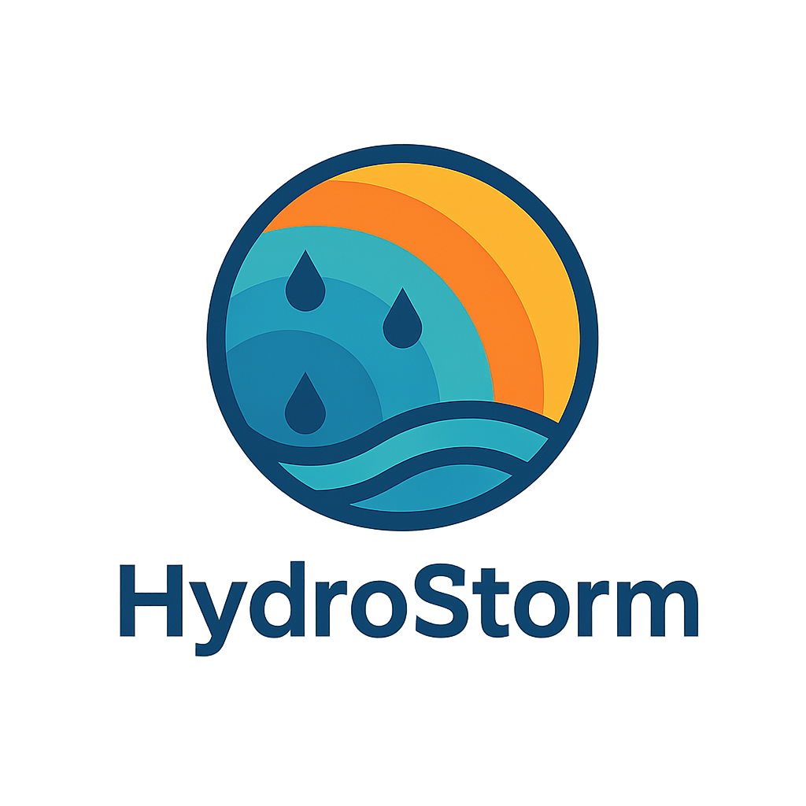

<p align="center">
  
</p>

# HydroStorm
**Radarbasierte Analyse von Starkregenereignissen**

HydroStorm ist eine modulare Shiny-App zur Auswertung radarbasierter Niederschlagsdaten (aktuell: RADKLIM / RADOLAN-Nachfolgeprodukte) für Starkregenanalysen über frei wählbare Untersuchungsgebiete.

---

## 🔧 Aktueller Funktionsumfang

Die App besteht aus drei Hauptreitern:

1. **📂 Datenimport**
2. **⚙️ Verarbeitung & Analyse**
3. **📊 Ergebnisse (inkl. KOSTRA-Abgleich)**

### 1️⃣ Datenimport

Im Tab **„Datenimport“** werden die Eingangsdaten geladen:

- **RADKLIM / RADOLAN-NetCDF**
  - Erwartet wird aktuell eine einzelne `.nc`-Datei (z. B. `YW_2017.002_YYYYMMDD.nc`).
  - Die App:
    - liest die Datei mit `terra::rast()`,
    - setzt **Koordinatensystem** (stereographische Projektion wie bei RADKLIM),
    - setzt den **Extent** auf den offiziellen RADOLAN/RADKLIM-Ausschnitt,
    - liest die **Zeitachse** aus (`terra::time()` oder abgeleitet aus dem Dateinamen),
    - wandelt die Werte bei Bedarf von **mm/h** in **mm pro Zeitschritt** (5 min bei YW, 60 min bei RW).

- **Zeitfilter**
  - Nach dem Einlesen wird der in der Datei enthaltene Zeitraum ermittelt.
  - Der `dateRangeInput` wird automatisch auf `min(t)`–`max(t)` gesetzt.
  - Beim Laden („**Daten laden**“) wird der Zeitbereich entsprechend gefiltert.

- **Untersuchungsgebiet (Maske)**
  - Upload eines **Shapefiles** über mehrere Dateien:
    - Alle vier Standard-Bestandteile müssen gemeinsam ausgewählt werden:  
      `.shp`, `.dbf`, `.shx`, `.prj`.
  - Die App:
    - kopiert die ausgewählten Dateien in ein temporäres Verzeichnis,
    - liest das Shapefile mit `terra::vect()`,
    - reprojiziert die Maske automatisch auf das **Koordinatensystem des RADKLIM-Rasters**.

- **Preview**
  - Ein **Vorschauplot** zeigt:
    - den ersten RADKLIM-Layer,
    - darüber die reprojizierte Maske.
  - Zusätzlich wird im Info-Text angezeigt:
    - Anzahl der Layer,
    - Zeitspanne,
    - Fläche der Maske (km²).

---

### 2️⃣ Verarbeitung & Analyse

Im Tab **„⚙️ Verarbeitung & Analyse“** werden die Daten zugeschnitten und zeitlich aggregiert.

- **Eingaben**
  - Auswahl der **Dauerstufen** (in Minuten), z. B. `30, 60, 120, 360, 720, 1440`.
  - Auswahl des **Flächenkennwerts**:
    - `max` → Flächenmaximum je Zeitschritt,
    - `mean` → Flächenmittelwert je Zeitschritt.

- **Ablauf bei „Analyse starten“**
  1. **Maske → Raster-KBS**  
     Die Maske wird falls nötig auf das CRS des RADKLIM-Rasters reprojiziert.
  2. **Flächenkennwert je Zeitschritt**  
     Mit `terra::extract(r, shape, fun = max/mean, na.rm = TRUE, ID = FALSE)` wird für jeden Zeitschritt ein Wert über das Gebiet bestimmt.
  3. **Zeitreihenaufbau**  
     Es entsteht eine Zeitreihe:
     - `datetime` (POSIXct),
     - `Max [mm] (Flächenmaximum)` *oder*  
       `Mean [mm] (Flächenmittelwert)` – je nach Auswahl.
  4. **Dauerstufenaggregation**
     - Die Basiszeitauflösung (`dt_min`) wird aus dem Produkt abgeleitet:
       - YW → 5 min,
       - RW → 60 min (aktuell unterstützt).
     - Für jede gewählte Dauerstufe \( D \) wird
       eine **gleitende Summe** mit Fensterbreite  
       \( w = D / dt\_\text{min} \) mittels `data.table::frollsum()` berechnet.
     - Die aggregierten Spalten heißen z. B.:
       - `D = 30 min [mm]`, `D = 60 min [mm]`, …

- **Ausgabe**
  - Die Ergebnisse werden als **scrollbare Tabelle** angezeigt (DataTable ohne Seitenblätterung).
  - Darstellung:
    - Zeitstempel im Format `YYYY-MM-DD HH:MM`,
    - alle numerischen Werte auf **2 Nachkommastellen** gerundet.

---

### 3️⃣ Ergebnisse & KOSTRA-Abgleich

Im Tab **„📊 Ergebnisse“** werden die analysierten Zeitreihen und der Vergleich mit KOSTRA dargestellt.

#### 3.1 Zeitreihe (HydroStorm)

- Plot „**Zeitreihe (HydroStorm)**“:
  - Auswahl, ob
    - die **Originalzeitreihe** (Basis-Zeitschritt), oder
    - eine **aggregierte Dauerstufe** (z. B. 60 min)
    geplottet werden soll.
  - Auswahl der **verfügbaren Dauerstufen**:
    - es werden nur diejenigen Dauerstufen angeboten,  
      die in der Verarbeitung tatsächlich berechnet wurden.
  - Darstellung:
    - Liniendiagramm `Niederschlag [mm]` über der Zeit,
    - Titel und Untertitel mit Produktkennung, Zeitraum usw.

#### 3.2 KOSTRA-Abgleich

- **KOSTRA-Abruf**
  - Die App nutzt die offizielle **KOSTRA REST-API**.
  - Zwei Modi:
    1. **Direkt über Kachelindex**  
       Eingabe des KOSTRA-Kachelindex (z. B. `129105`).
    2. **Über Koordinate**  
       Wird kein Index eingegeben, wird der **Schwerpunkt des Untersuchungsgebiets** verwendet:
       - dafür liegt parallel zur RADKLIM-Maske eine zweite Maske in **EPSG:25832** vor (`shared$shape_25832`),
       - der Mittelpunkt wird an die KOSTRA-API übergeben.
  - Der API-Schlüssel wird über die Umgebungsvariable `KOSTRA_KEY` bereitgestellt.

- **KOSTRA-Datenstruktur**
  - Die API liefert für verschiedene:
    - **Dauerstufen** (z. B. 5 min bis 1440 min),
    - **Jährlichkeiten** (z. B. 1, 2, 3, 5, 10, 20, 30, 50, 100 a),
    - **Typen**:  
      - `HN` (Niederschlagshöhen),  
      - `RN` (Regenspenden),  
      - `UC` (Unsicherheiten),
    entsprechende Werte.
  - In der App wird das in ein `data.table` umgewandelt und aufbereitet:
    - Fokus im Vergleich: **HN (Niederschlagshöhen)**
    - Werte werden auf **1 Nachkommastelle** gerundet.

- **Dauerstufen-Vergleichsplot**
  - Plot „**Dauerstufenvergleich (HydroStorm vs. KOSTRA)**“:
    - HydroStorm:
      - für jede Dauerstufe wird das **Maximum** der aggregierten Zeitreihe verwendet.
    - KOSTRA:
      - aus den HN-Werten für eine wählbare **Jährlichkeit** \( T \) (z. B. 2, 5, 10, 20, 50, 100 a).
    - Steuerung über:
      - Auswahl der Jährlichkeit \( T \) (Dropdown),
      - ggf. KOSTRA-Kachelindex.
    - Darstellung:
      - log-Skala der Dauerstufe (x-Achse),
      - Niederschlagshöhe in mm (y-Achse),
      - Legende mit:
        - „HydroStorm“ (Ereignis),
        - „T = xx a“ (gewählte KOSTRA-Jährlichkeit).

- **KOSTRA-Tabelle**
  - Zusätzlich wird eine **Tabelle mit den KOSTRA-HN-Werten** angezeigt:
    - Zeilen: Dauerstufen (in Minuten),
    - Spalten: Jährlichkeiten \( T \),
    - Zellen: Niederschlagshöhen [mm] (eine Nachkommastelle),
    - Tabelle ist horizontal und vertikal scrollbar,
    - optionaler CSV-Export der KOSTRA-Daten.

---

## 💾 CSV-Export

- **HydroStorm-Ergebnisse**
  - Download der aggregierten Zeitreihe (inkl. aller Dauerstufen) als CSV.
- **KOSTRA-Daten**
  - Download der vollständigen KOSTRA-Tabelle (alle Dauerstufen × alle Jährlichkeiten) als CSV.

---

## 🔌 Technische Architektur

Die App ist modular aufgebaut:

- `app.R`
  - UI (navbarPage) & Server-Logik,
  - initialisiert `reactiveValues(shared)` für:
    - `rast` (SpatRaster),
    - `shape` (Maske im RADKLIM-KBS),
    - `shape_25832` (Maske in EPSG:25832),
    - `times`, `product`, `dt_min`,
    - `result` (aggregierte Zeitreihe),
    - `kostra` (KOSTRA-Datenframe) etc.
- `R/mod_import.R`
  - Modul **Datenimport** (NetCDF + Shape, Reprojektion, Preview).
- `R/mod_process.R`
  - Modul **Verarbeitung** (Flächenkennwert, Aggregation, Tabelle).
- `R/mod_plot.R`
  - Modul **Ergebnisse** (Zeitreihenplot, KOSTRA-Vergleich, Tabellen).
- `R/utils.R`
  - Hilfsfunktionen:
    - RADKLIM-Einlesen,
    - Dauerstufenaggregation,
    - KOSTRA-API-Anbindung, …

Verwendete Kernpakete:

- `shiny`, `bslib`, `shinyWidgets`, `shinycssloaders`, `DT`
- `terra`, `sf`, `tidyterra`
- `data.table`, `readr`
- `httr`, `jsonlite`
- `ggplot2`, `tidyverse`-Core

---

## 🚀 Lokaler Start

### 1. Repository klonen

```bash
git clone https://github.com/<dein-account>/hydroStorm.git
cd hydroStorm