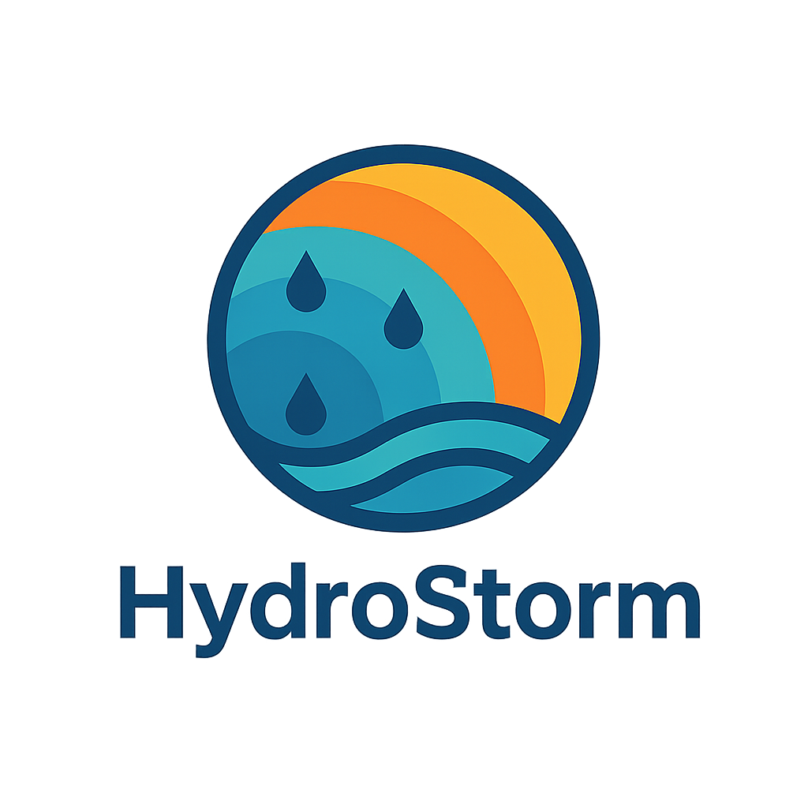

<p align="center">
  
</p>

# HydroStorm
**Radarbasierte Analyse von Starkregenereignissen**

HydroStorm ist eine modulare Shiny-App zur Auswertung radarbasierter Niederschlagsdaten (RADKLIM/RADOLAN, Produkte YW und RW) für Starkregenanalysen über frei wählbare Untersuchungsgebiete. Die App bildet Dauerstufen-Zeitreihen, stellt sie KOSTRA gegenüber, ordnet Ereignisse nach dem **Starkregenindex (SRI)** ein und erzeugt auf Wunsch einen **Bericht als Word oder PDF**.

---

## 🔧 Funktionsumfang

Die App besteht aus fünf Reitern:

1. **📂 Datenimport**
2. **⚙️ Verarbeitung & Analyse**
3. **📊 Ergebnisse** (Zeitreihe, KOSTRA-Vergleich, SRI-Einordnung)
4. **📄 Bericht** (Word/PDF)
5. **ℹ️ Info & Hilfe**

### 1️⃣ Datenimport

- **RADKLIM/RADOLAN-NetCDF** (`.nc`): eine oder mehrere Dateien (z. B. mehrere Tage) werden geladen, zusammengefügt, mit stereografischer Projektion und RADOLAN-Extent versehen; die Zeitachse kommt aus `terra::time()` oder – als Fallback – aus dem Dateinamen.
- **Auswertungsgebiet** in drei Varianten:
  - **Shapefile** (`.shp`, `.dbf`, `.shx`, `.prj` gemeinsam auswählen),
  - **Punkt** direkt in die Karte klicken,
  - **Adresse** eingeben und über OpenStreetMap/Nominatim geokodieren.
  - Punkt und Adresse werden intern zu einem 1-km-Puffer.
- **Zeitfilter**: nach dem Upload wird der verfügbare Zeitraum automatisch gesetzt.
- **Interaktive Karte**: nach dem Laden wird die Niederschlagssumme über den Zeitraum halbtransparent über eine OpenStreetMap-Karte gelegt (mit Farblegende), zoombar; das Gebiet bzw. der Punkt werden markiert.
- **Ortsname**: wird automatisch bestimmt (eingegebene Adresse bzw. Reverse-Geocoding des Schwerpunkts) und in Plots/Bericht verwendet.

### 2️⃣ Verarbeitung & Analyse

- Auswahl der **Dauerstufen** (Minuten).
- Wahl des **Flächenkennwerts** je Zeitschritt: **Mittelwert** (Standard) oder **Maximum** über das Gebiet (`terra::extract`).
- Aufbau der Zeitreihe und **rechtsbündiger gleitender Summen** je Dauerstufe (`data.table::frollsum`).
- Ausgabe als scrollbare Tabelle.

### 3️⃣ Ergebnisse

- **Zeitreihe (interaktiv, plotly)** je Dauerstufe mit Hover/Zoom; **Export** als PNG/PDF/SVG in wählbarer Größe/Auflösung (`ggsave`).
- **KOSTRA-Abgleich** über die offizielle REST-API (Kachelindex oder automatisch über Gebiets-/Punktkoordinate in EPSG:25832).
- **Dauerstufenvergleich HydroStorm vs. KOSTRA** – optional mit **SRI-Einfärbung** der Ereignis-Punkte (per Checkbox an/aus).
- **SRI-Einordnung**: farbige Kachel mit dem maßgebenden Starkregenindex und Tabelle je Dauerstufe.
- **CSV-Export** von HydroStorm- und KOSTRA-Daten.

### 4️⃣ Bericht

- Export als **Word** oder **PDF** mit Titelkopf/Metadaten (Ort, Zeitraum, Produkt, Modus, Aggregation), maßgebender SRI-Infobox, Zeitreihen-Plot, KOSTRA-Vergleich mit SRI und SRI-/KOSTRA-Tabellen.
- Logo in der Kopfzeile, Seitenzahl in der Fußzeile; PDF im Arial-Satz, KOSTRA-Tabelle im Querformat.
- Grundlage sind die im Reiter „Ergebnisse“ gewählten Einstellungen. PDF benötigt eine LaTeX-Installation (`tinytex`); Word funktioniert ohne.

---

## 📐 Starkregenindex (SRI)

Einordnung nach dem einheitlichen Verfahren von **Schmitt et al. (2018)**: Je Dauerstufe wird die beobachtete Niederschlagshöhe über KOSTRA einer Wiederkehrzeit zugeordnet und daraus der Index 1–12 abgeleitet.

| SRI | Kriterium | Kategorie |
|----|----|----|
| 1 | 1–2 a | Starkregen |
| 2 | 3–5 a | Starkregen |
| 3 | 10 a | intensiver Starkregen |
| 4 | 20 a | intensiver Starkregen |
| 5 | 30 a | außergewöhnlicher Starkregen |
| 6 | 50 a | außergewöhnlicher Starkregen |
| 7 | 100 a | außergewöhnlicher Starkregen |
| 8–12 | > 100 a über Faktor hN/hN(100a) | extremer Starkregen |

Der maßgebende SRI eines Ereignisses ist das Maximum über alle Dauerstufen. Für den Bereich über 100 a (SRI 8–12) wird der Extrapolationsfaktor `hN/hN(100a)` gebildet.

---

## 🔌 Technische Architektur

- `app.R` – UI (navbarPage) und Server, initialisiert `reactiveValues(shared)` (Raster, Gebiet, Zeitachse, Produkt, Ergebnis, KOSTRA, Ort, Auswahl u. a.) und bindet die Module ein.
- `R/mod_import.R` – Datenimport (NetCDF, Gebietswahl, Reverse-Geocoding, interaktive Leaflet-Karte mit Raster-Overlay).
- `R/mod_process.R` – Verarbeitung (Flächenkennwert, Dauerstufenaggregation, Tabelle).
- `R/mod_plot.R` – Ergebnisse (interaktive Plots, KOSTRA-Abgleich, SRI-Reiter, Export).
- `R/mod_report.R` – Bericht-Export (Word/PDF via R Markdown).
- `R/utils.R` – Hilfsfunktionen: RADKLIM-Einlesen, KOSTRA-API, Ortsbestimmung, SRI-Logik (`compute_sri`, `SRI_COLORS`) sowie die wiederverwendbaren Plot-/Tabellen-Bausteine (`hydro_ts_plot`, `hydro_kostra_plot`, `hydro_sri_table`), die App und Bericht gemeinsam nutzen.
- `report/hydrostorm_report.Rmd` – parametrisierte Berichtsvorlage (Word + PDF).
- `report/reference.docx` – Word-Referenzvorlage mit Logo-Kopfzeile.

**Kernpakete:** `shiny`, `bslib`, `shinyWidgets`, `shinycssloaders`, `DT`, `plotly`; `terra`, `sf`, `tidyterra`, `leaflet`; `data.table`, `readr`; `httr`, `jsonlite`, `tidygeocoder`; `ggplot2`; `rmarkdown`, `knitr`, `flextable`; für PDF zusätzlich `tinytex` (LaTeX).

---

## 🚀 Lokaler Start

```r
# benötigte Pakete (einmalig)
install.packages(c(
  "shiny", "bslib", "shinyWidgets", "shinycssloaders", "DT", "plotly",
  "terra", "sf", "tidyterra", "leaflet",
  "data.table", "readr", "httr", "jsonlite", "tidygeocoder",
  "ggplot2", "rmarkdown", "knitr", "flextable"
))
# für den PDF-Export:
install.packages("tinytex"); tinytex::install_tinytex()

# App starten
shiny::runApp()
```

Der KOSTRA-API-Schlüssel wird über die Umgebungsvariable `KOSTRA_KEY` bereitgestellt.

### Deployment auf Posit Connect

Vor dem Deploy `rsconnect::writeManifest()` ausführen (damit u. a. `plotly`, `rmarkdown`, `knitr`, `flextable` in der `manifest.json` landen) und sicherstellen, dass der Ordner `report/` mitdeployt wird. Für den PDF-Export muss auf der Zielumgebung LaTeX vorhanden sein.

---

## 📄 Lizenz & Kontakt

HydroStorm steht unter der **GNU General Public License, Version 3 (GPL-3.0)** – Details in `LICENSE`. Bereitstellung zu Forschungs- und Planungszwecken; die Interpretation der Ergebnisse erfolgt in eigener Verantwortung. Für Entscheidungen in Planung, Genehmigung oder Gefahrenabwehr sind stets zusätzliche Datengrundlagen heranzuziehen.

Kontakt: [Felix Simon](mailto:felix.simon@hs-bochum.de) · © 2026 Felix Simon, Hochschule Bochum.

**Quelle SRI:** Schmitt, T. G.; Krüger, M.; Pfister, A.; Becker, M.; Mudersbach, C.; Fuchs, L.; Hoppe, H.; Lakes, I. (2018): Einheitliches Konzept zur Bewertung von Starkregenereignissen mittels Starkregenindex. KW Korrespondenz Wasserwirtschaft, Heft 2/2018.
